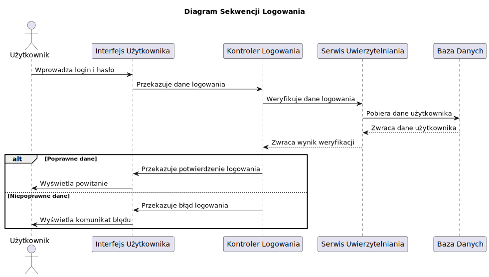
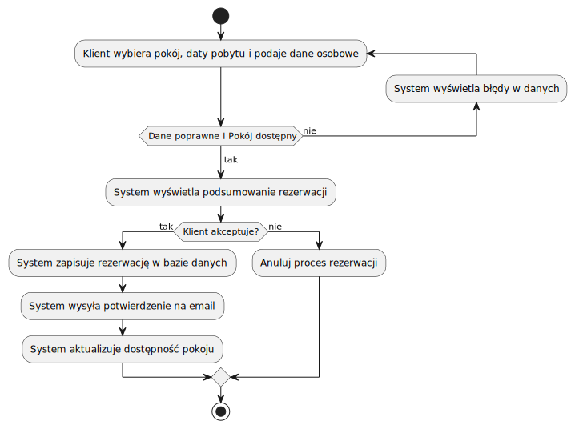
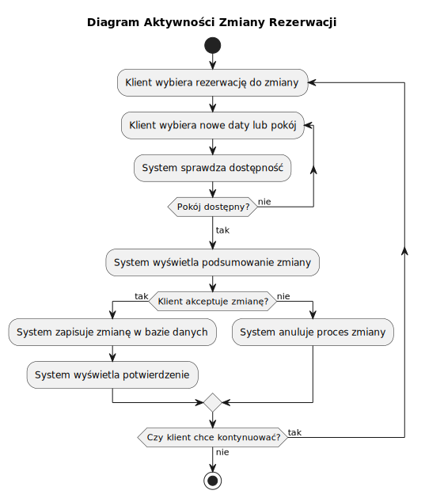
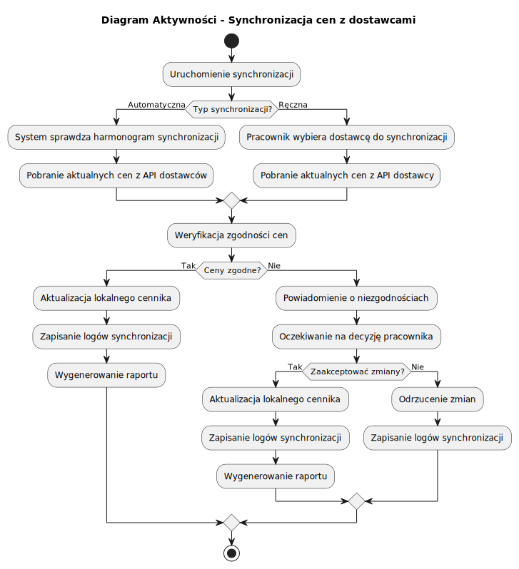
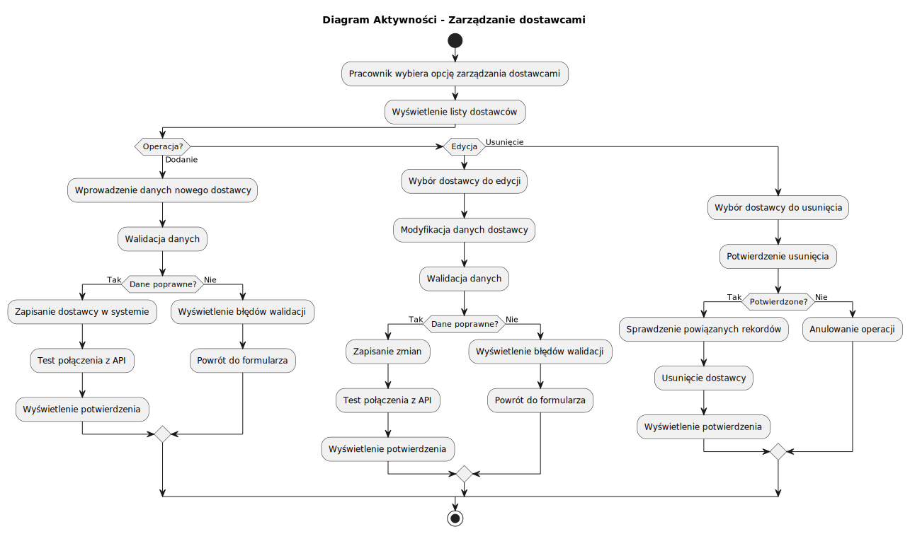
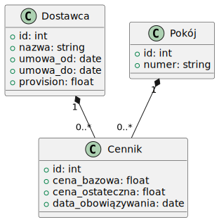
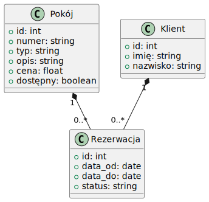

# Dokumentacja Projektowa Systemu Rezerwacji Hotelowej

## Spis Treści
1. [Wprowadzenie](#wprowadzenie)
2. [Cele i Przypuszczalne Problemy Projektu](#cele-i-przypuszczalne-problemy-projektu)
3. [Uzasadnienie Powstania Projektu](#uzasadnienie-powstania-projektu)
4. [Diagram Przypadków Użycia](#diagram-przypadków-użycia)
5. [Diagramy Aktywności](#diagramy-aktywności)
6. [Diagramy](#diagramy)
7. [Opis Modeli Danych](#opis-modeli-danych)
8. [Opis Bazy Danych](#opis-bazy-danych)
9. [Technologie Użyte](#technologie-użyte)
10. [Konkluzje i Alternatywy](#konkluzje-i-alternatywy)

## Wprowadzenie

Niniejszy dokument opisuje projekt systemu rezerwacji hotelowej. System ma na celu umożliwienie klientom rezerwacji pokoi, a personelowi zarządzanie pokojami i obsługę gości.

## Diagram Przypadków Użycia (Use Case Diagram)

*   **Aktorzy:**
    *   Klient
    *   Pracownik hotelu
*   **Przypadki użycia:**
    *   **Klient:**
        *   **Przeglądanie dostępnych pokoi:**
            *   **Warunki wstępne:** Klient jest na stronie głównej systemu.
            *   **Główne kroki:**
                1.  System wyświetla listę dostępnych pokoi.
                2.  Klient może przeglądać szczegóły każdego pokoju (zdjęcia, opis, cena).
                3.  Klient może filtrować pokoje według różnych kryteriów (np. typ pokoju, cena).
            *   **Warunki końcowe:** Klient przegląda listę dostępnych pokoi.
            *   **Wyjątki:** Brak dostępnych pokoi, błąd połączenia z bazą danych.
        *   **Rezerwacja pokoju:**
            *   **Warunki wstępne:** Klient jest zalogowany i przegląda listę dostępnych pokoi.
            *   **Główne kroki:**
                1.  Klient wybiera pokój i daty pobytu.
                2.  System sprawdza dostępność pokoju w wybranych terminach.
                3.  System prosi o potwierdzenie rezerwacji.
                4.  Klient potwierdza rezerwację.
                5.  System zapisuje rezerwację w bazie danych.
                6.  System wyświetla potwierdzenie rezerwacji.
            *   **Warunki końcowe:** Rezerwacja została zapisana w systemie.
            *   **Wyjątki:** Pokój niedostępny, błąd płatności, błąd zapisu do bazy danych.
        *   **Anulowanie rezerwacji:**
            *   **Warunki wstępne:** Klient jest zalogowany i ma aktywne rezerwacje.
            *   **Główne kroki:**
                1.  Klient wybiera rezerwację do anulowania.
                2.  System prosi o potwierdzenie anulowania.
                3.  Klient potwierdza anulowanie.
                4.  System anuluje rezerwację w bazie danych.
                5.  System wyświetla potwierdzenie anulowania.
            *   **Warunki końcowe:** Rezerwacja została anulowana.
            *   **Wyjątki:** Brak rezerwacji do anulowania, błąd zapisu do bazy danych.
        *   **Logowanie do systemu:**
            *   **Warunki wstępne:** Klient jest na stronie logowania.
            *   **Główne kroki:**
                1.  Klient podaje login i hasło.
                2.  System weryfikuje dane logowania.
                3.  System loguje klienta do systemu.
            *   **Warunki końcowe:** Klient jest zalogowany do systemu.
            *   **Wyjątki:** Nieprawidłowy login lub hasło, błąd połączenia z bazą danych.
        *   **Rejestracja w systemie:**
            *   **Warunki wstępne:** Klient jest na stronie rejestracji.
            *   **Główne kroki:**
                1.  Klient podaje dane rejestracyjne (imię, nazwisko, email, hasło).
                2.  System weryfikuje, czy email nie jest już zarejestrowany.
                3.  System zapisuje dane klienta w bazie danych.
                4.  System wyświetla potwierdzenie rejestracji.
            *   **Warunki końcowe:** Klient jest zarejestrowany w systemie.
            *   **Wyjątki:** Email już zarejestrowany, błąd zapisu do bazy danych.
    *   **Pracownik hotelu:**
        *   **Zarządzanie pokojami (dodawanie, edycja, usuwanie):**
             *   **Warunki wstępne:** Pracownik jest zalogowany do systemu.
             *   **Główne kroki:**
                1.  Pracownik wybiera opcję zarządzania pokojami.
                2.  System wyświetla opcje: dodawanie, edycja, usuwanie.
                3.  Pracownik wybiera jedną z opcji.
                4.  W zależności od wybranej opcji, system prosi o odpowiednie dane (np. numer pokoju, typ, opis, cena).
                5.  System zapisuje zmiany w bazie danych.
                6.  System wyświetla potwierdzenie operacji.
             *   **Warunki końcowe:** Pokój został dodany, edytowany lub usunięty.
             *   **Wyjątki:** Błąd zapisu do bazy danych, nieprawidłowe dane.
        *   **Potwierdzanie rezerwacji:**
            *   **Warunki wstępne:** Pracownik jest zalogowany do systemu i ma dostęp do listy rezerwacji.
            *   **Główne kroki:**
                1.  Pracownik przegląda listę rezerwacji.
                2.  Pracownik wybiera rezerwację do potwierdzenia.
                3.  System prosi o potwierdzenie.
                4.  Pracownik potwierdza rezerwację.
                5.  System zmienia status rezerwacji na "potwierdzona".
                6.  System wyświetla potwierdzenie.
            *   **Warunki końcowe:** Rezerwacja została potwierdzona.
            *   **Wyjątki:** Brak rezerwacji do potwierdzenia, błąd zapisu do bazy danych.
        *   **Obsługa gości (zameldowanie, wymeldowanie):**
            *   **Warunki wstępne:** Pracownik jest zalogowany do systemu.
            *   **Główne kroki:**
                1.  Pracownik wybiera opcję obsługi gości.
                2.  System wyświetla opcje: zameldowanie, wymeldowanie.
                3.  Pracownik wybiera jedną z opcji.
                4.  W zależności od wybranej opcji, system prosi o odpowiednie dane (np. imię, nazwisko, numer rezerwacji, numer pokoju).
                5.  System rejestruje zameldowanie lub wymeldowanie gościa.
                6.  System wyświetla potwierdzenie operacji.
            *   **Warunki końcowe:** Gość został zameldowany lub wymeldowany.
            *   **Wyjątki:** Brak rezerwacji, błąd zapisu do bazy danych.
        *   **Przeglądanie rezerwacji:**
            *   **Warunki wstępne:** Pracownik jest zalogowany do systemu.
            *   **Główne kroki:**
                1.  Pracownik wybiera opcję przeglądania rezerwacji.
                2.  System wyświetla listę rezerwacji.
                3.  Pracownik może przeglądać szczegóły każdej rezerwacji.
            *   **Warunki końcowe:** Pracownik przegląda listę rezerwacji.
            *   **Wyjątki:** Brak rezerwacji, błąd połączenia z bazą danych.
        *   **Logowanie do systemu:**
            *   **Warunki wstępne:** Pracownik jest na stronie logowania.
            *   **Główne kroki:**
                1.  Pracownik podaje login i hasło.
                2.  System weryfikuje dane logowania.
                3.  System loguje pracownika do systemu.
            *   **Warunki końcowe:** Pracownik jest zalogowany do systemu.
            *   **Wyjątki:** Nieprawidłowy login lub hasło, błąd połączenia z bazą danych.

    *   **Pracownik hotelu - Zarządzanie dostawcami:**
        *   **Konfiguracja integracji z dostawcami:**
            *   **Warunki wstępne:** Pracownik jest zalogowany i ma uprawnienia menedżera.
            *   **Główne kroki:**
                1.  Pracownik wybiera opcję konfiguracji dostawców.
                2.  System wyświetla listę dostępnych platform (np. Booking.com, Airbnb).
                3.  Pracownik konfiguruje parametry integracji (API key, URL endpointów).
                4.  System testuje połączenie z platformą.
                5.  System zapisuje konfigurację.
            *   **Warunki końcowe:** Integracja z platformą jest skonfigurowana.
            *   **Wyjątki:** Błąd połączenia, nieprawidłowe dane konfiguracyjne.

        *   **Monitorowanie statusu integracji:**
            *   **Warunki wstępne:** Integracja z platformą jest skonfigurowana.
            *   **Główne kroki:**
                1.  System automatycznie monitoruje status integracji.
                2.  W przypadku błędów, system powiadamia pracownika.
                3.  Pracownik może wyświetlić szczegóły statusu.
            *   **Warunki końcowe:** Pracownik ma aktualne informacje o statusie integracji.
            *   **Wyjątki:** Brak połączenia z platformą, błąd API.

        *   **Ręczna synchronizacja danych:**
            *   **Warunki wstępne:** Integracja z platformą jest skonfigurowana.
            *   **Główne kroki:**
                1.  Pracownik wybiera opcję ręcznej synchronizacji.
                2.  System pobiera dane z platformy (rezerwacje, dostępność, ceny).
                3.  System aktualizuje lokalną bazę danych.
                4.  System wyświetla raport synchronizacji.
            *   **Warunki końcowe:** Dane są zsynchronizowane między systemem a platformą.
            *   **Wyjątki:** Błąd synchronizacji, konflikt danych.

## Diagramy Aktywności

System zawiera następujące diagramy aktywności opisujące kluczowe procesy:

1. [Rezerwacja pokoju](diagrams/activity_diagram_rezerwacja_pokoju.svg)
2. [Zarządzanie pokojami](diagrams/activity_diagram_zarzadzanie_pokojami.svg)
3. [Logowanie](diagrams/activity_diagram_logowanie.svg)
4. [Zmiana rezerwacji](diagrams/actvitiy_diagram_zmiana_rezerwacji.svg)
5. [Synchronizacja cen](diagrams/activity_diagram_synchronizacja_cen.svg)
6. [Zarządzanie dostawcami](diagrams/activity_diagram_zarzadzanie_dostawcami.svg)

Szczegółowe opisy procesów znajdują się w sekcji [Diagram Przypadków Użycia](#diagram-przypadków-użycia).

1.  **Start:** Proces rozpoczyna się, gdy klient chce zarezerwować pokój.
2.  **Wyświetl dostępne pokoje:** System prezentuje klientowi listę dostępnych pokoi wraz z ich opisami i cenami.
3.  **Wybór pokoju:** Klient wybiera konkretny pokój.
4.  **Podanie danych:** Klient podaje swoje dane osobowe oraz daty pobytu.
5.  **Sprawdzenie dostępności:** System sprawdza, czy wybrany pokój jest dostępny w podanych terminach.
6.  **Dostępny?**
    *   **Tak:** Przejdź do punktu 7.
    *   **Nie:** System informuje klienta o braku dostępności i wraca do punktu 2 (wyświetlenie dostępnych pokoi).
7.  **Potwierdzenie rezerwacji:** System wyświetla podsumowanie rezerwacji.
8.  **Akceptacja rezerwacji:** Klient akceptuje rezerwację.
9.  **Zapisanie rezerwacji:** System zapisuje rezerwację w bazie danych.
10. **Wyświetlenie potwierdzenia:** System wyświetla potwierdzenie rezerwacji wraz z numerem rezerwacji.
11. **Koniec:** Proces rezerwacji zakończony.

### Zarządzanie Pokojami

Opis diagramu aktywności dla zarządzania pokojami:

1.  **Start:** Proces rozpoczyna się, gdy pracownik hotelu chce zarządzać pokojami.
2.  **Wyświetl menu zarządzania pokojami:** System prezentuje pracownikowi opcje zarządzania pokojami (dodawanie, edycja, usuwanie).
3.  **Wybór opcji:** Pracownik wybiera jedną z opcji: dodawanie, edycja lub usuwanie pokoju.
4.  **Dodawanie pokoju:**
    *   System prosi o podanie danych nowego pokoju (numer, typ, opis, cena).
    *   System zapisuje nowy pokój w bazie danych.
    *   Przejdź do punktu 8.
5.  **Edycja pokoju:**
    *   System prosi o podanie numeru pokoju do edycji.
    *   System wyświetla dane wybranego pokoju.
    *   System prosi o wprowadzenie zmian.
    *   System zapisuje zmiany w bazie danych.
    *   Przejdź do punktu 8.
6.  **Usuwanie pokoju:**
    *   System prosi o podanie numeru pokoju do usunięcia.
    *   System usuwa pokój z bazy danych.
    *   Przejdź do punktu 8.
7.  **Potwierdzenie:** System wyświetla potwierdzenie wykonania operacji.
8.  **Koniec:** Proces zarządzania pokojami zakończony.

### Logowanie do Systemu

Opis diagramu aktywności dla procesu logowania:

1.  **Start:** Proces rozpoczyna się, gdy użytkownik (klient lub pracownik hotelu) chce zalogować się do systemu.
2.  **Wybór roli:** Użytkownik wybiera swoją rolę (klient lub pracownik hotelu).
3.  **Podanie danych logowania:** System prosi o podanie danych logowania (login i hasło).
4.  **Weryfikacja danych:** System weryfikuje dane logowania w bazie danych.
5.  **Poprawne dane?**
    *   **Tak:** System loguje użytkownika i przechodzi do odpowiedniego interfejsu (klienta lub pracownika). Przejdź do punktu 7.
    *   **Nie:** System wyświetla komunikat o błędzie i wraca do punktu 3 (podanie danych logowania).
6.  **Dostęp do systemu:** Użytkownik ma dostęp do odpowiednich funkcji systemu.
7.  **Koniec:** Proces logowania zakończony.

### Rejestracja Użytkownika

Opis diagramu aktywności dla procesu rejestracji:

1.  **Start:** Proces rozpoczyna się, gdy użytkownik (klient) chce zarejestrować się w systemie.
2.  **Wybór rejestracji:** Użytkownik wybiera opcję rejestracji.
3.  **Podanie danych rejestracyjnych:** System prosi o podanie danych rejestracyjnych (imię, nazwisko, email, hasło).
4.  **Weryfikacja danych:** System weryfikuje, czy podany email nie jest już zarejestrowany.
5.  **Email zajęty?**
    *   **Tak:** System wyświetla komunikat o błędzie i wraca do punktu 3 (podanie danych rejestracyjnych).
    *   **Nie:** Przejdź do punktu 6.
6.  **Zapisanie danych:** System zapisuje dane użytkownika w bazie danych.
7.  **Potwierdzenie rejestracji:** System wyświetla potwierdzenie rejestracji.
8.  **Koniec:** Proces rejestracji zakończony.

### Anulowanie Rezerwacji

Opis diagramu aktywności dla procesu anulowania rezerwacji:

1.  **Start:** Proces rozpoczyna się, gdy klient chce anulować rezerwację.
2.  **Logowanie:** Klient loguje się do systemu.
3.  **Wyświetlenie rezerwacji:** System wyświetla listę rezerwacji klienta.
4.  **Wybór rezerwacji:** Klient wybiera rezerwację do anulowania.
5.  **Potwierdzenie anulowania:** System prosi o potwierdzenie anulowania rezerwacji.
6.  **Anulowanie?**
    *   **Tak:** System anuluje rezerwację i przechodzi do punktu 7.
    *   **Nie:** System wraca do punktu 3 (wyświetlenie rezerwacji).
7.  **Potwierdzenie anulowania:** System wyświetla potwierdzenie anulowania rezerwacji.
8.  **Koniec:** Proces anulowania rezerwacji zakończony.

### Zmiana Rezerwacji

Opis diagramu aktywności dla procesu zmiany rezerwacji:

1.  **Start:** Proces rozpoczyna się, gdy klient chce zmienić rezerwację.
2.  **Logowanie:** Klient loguje się do systemu.
3.  **Wyświetlenie rezerwacji:** System wyświetla listę rezerwacji klienta.
4.  **Wybór rezerwacji:** Klient wybiera rezerwację do zmiany.
5.  **Wybór nowych danych:** Klient wybiera nowe daty lub pokój.
6.  **Sprawdzenie dostępności:** System sprawdza, czy wybrany pokój jest dostępny w nowych terminach.
7.  **Dostępny?**
    *   **Tak:** Przejdź do punktu 8.
    *   **Nie:** System informuje klienta o braku dostępności i wraca do punktu 5 (wybór nowych danych).
8.  **Potwierdzenie zmiany:** System wyświetla podsumowanie zmiany rezerwacji.
9.  **Akceptacja zmiany:** Klient akceptuje zmianę rezerwacji.
10. **Zapisanie zmiany:** System zapisuje zmianę rezerwacji w bazie danych.
11. **Wyświetlenie potwierdzenia:** System wyświetla potwierdzenie zmiany rezerwacji.
12. **Koniec:** Proces zmiany rezerwacji zakończony.

### Obsługa Gościa

Opis diagramu aktywności dla obsługi gościa (zameldowanie i wymeldowanie):

1.  **Start:** Proces rozpoczyna się, gdy gość przybywa do hotelu (zameldowanie) lub chce opuścić hotel (wymeldowanie).
2.  **Wybór operacji:** Pracownik hotelu wybiera, czy gość się melduje, czy wymeldowuje.
3.  **Zameldowanie:**
    *   System prosi o podanie danych gościa (imię, nazwisko, numer rezerwacji).
    *   System sprawdza rezerwację.
    *   System przydziela pokój (jeśli nie był wcześniej przydzielony).
    *   System rejestruje zameldowanie gościa.
    *   Przejdź do punktu 6.
4.  **Wymeldowanie:**
    *   System prosi o podanie danych gościa (imię, nazwisko, numer pokoju).
    *   System sprawdza dane gościa.
    *   System rejestruje wymeldowanie gościa.
    *   Przejdź do punktu 6.
5.  **Potwierdzenie:** System wyświetla potwierdzenie wykonania operacji (zameldowania lub wymeldowania).
6.  **Koniec:** Proces obsługi gościa zakończony.

## Diagramy

### Diagram Przypadków Użycia

Diagram przypadków użycia przedstawia interakcje między aktorami (klient, pracownik hotelu) a systemem. Aktorzy wykonują różne przypadki użycia, takie jak rezerwacja pokoju, zarządzanie pokojami, logowanie do systemu, itp.

[Diagram przypadków użycia](diagrams/use_case_diagram.svg)

### Diagramy Sekwencji
Diagramy sekwencji przedstawiają interakcje między obiektami w systemie w czasie. Pomagają zrozumieć, jak różne komponenty systemu współpracują ze sobą, aby zrealizować dany przypadek użycia.

#### Przykład:
[Diagram sekwencji logowania](diagrams/diagram_sekwencji_logowania.svg)

### Diagramy Aktywności
Diagramy aktywności opisują przepływ pracy w systemie dla różnych przypadków użycia. Każdy diagram przedstawia sekwencję kroków, które są wykonywane w ramach danego przypadku użycia. Przykłady diagramów aktywności to rezerwacja pokoju, zarządzanie pokojami, logowanie do systemu, itp.

#### Rezerwacja Pokoju
[Diagram aktywności rezerwacji pokoju](diagrams/activity_diagram_rezerwacja_pokoju.svg)

#### Zarządzanie Pokojami
[Diagram aktywności zarządzania pokojami](diagrams/activity_diagram_zarzadzanie_pokojami.svg)

#### Logowanie
[Diagram aktywności logowania](diagrams/activity_diagram_logowanie.svg)

#### Zmiana Rezerwacji
[Diagram aktywności zmiany rezerwacji](diagrams/actvitiy_diagram_zmiana_rezerwacji.svg)

#### Synchronizacja cen z dostawcami
[Diagram aktywności synchronizacji cen](diagrams/activity_diagram_synchronizacja_cen.svg)

#### Zarządzanie dostawcami  
[Diagram aktywności zarządzania dostawcami](diagrams/activity_diagram_zarzadzanie_dostawcami.svg)

### Diagramy Klas

Diagramy klas przedstawiają strukturę danych systemu, w tym klasy, ich atrybuty i relacje między nimi. Diagramy klas opisują modele danych, takie jak Użytkownik, Pracownik, Gość, Pokój, Rezerwacja.

[Diagram klas - Użytkownik](diagrams/class_diagram_uzytkownik.svg)

[Diagram klas - Dostawca](diagrams/class_diagram_dostawca.svg)

[Diagram klas - Pokój](diagrams/class_diagram_dostawca.svg)

## Modele Danych i Struktura Bazy

### Użytkownicy i Autoryzacja

#### Użytkownik (User)
* `id`: INTEGER PRIMARY KEY AUTOINCREMENT
* `username`: TEXT UNIQUE NOT NULL (max 50 znaków)
* `password_hash`: TEXT NOT NULL
* `email`: TEXT UNIQUE NOT NULL
* `role`: TEXT NOT NULL (enum: 'guest', 'staff', 'admin')
* `created_at`: DATETIME DEFAULT CURRENT_TIMESTAMP
* **Relacje:**
  * Jeden-do-jednego z Gościem (Guest)
  * Jeden-do-jednego z Pracownikiem (Staff)

#### Gość (Guest)
* `id`: INTEGER PRIMARY KEY AUTOINCREMENT
* `user_id`: INTEGER FOREIGN KEY REFERENCES User(id)
* `first_name`: TEXT NOT NULL
* `last_name`: TEXT NOT NULL  
* `phone`: TEXT
* **Relacje:**
  * Jeden-do-wielu z Rezerwacjami (Reservation)

#### Pracownik (Staff)
* `id`: INTEGER PRIMARY KEY AUTOINCREMENT
* `user_id`: INTEGER FOREIGN KEY REFERENCES User(id)
* `first_name`: TEXT NOT NULL
* `last_name`: TEXT NOT NULL
* `position`: TEXT NOT NULL (enum: 'receptionist', 'manager')
* **Relacje:**
  * Jeden-do-wielu z Operacjami (Operation)

### Zarządzanie Pokojami

#### Pokój (Room)
* `id`: INTEGER PRIMARY KEY AUTOINCREMENT
* `room_number`: TEXT UNIQUE NOT NULL
* `room_type`: TEXT NOT NULL (enum: 'single', 'double', 'suite')
* `description`: TEXT
* `base_price`: REAL NOT NULL
* `status`: TEXT NOT NULL (enum: 'available', 'occupied', 'maintenance')
* **Relacje:**
  * Jeden-do-wielu z Rezerwacjami (Reservation)
  * Jeden-do-wielu z Cennikiem (Pricing)
  * Jeden-do-wielu z Historią Zmian (RoomHistory)

#### Historia Zmian Pokoju (RoomHistory)
* `id`: INTEGER PRIMARY KEY AUTOINCREMENT
* `room_id`: INTEGER FOREIGN KEY REFERENCES Room(id)
* `changed_by`: INTEGER FOREIGN KEY REFERENCES User(id)
* `change_type`: TEXT NOT NULL (enum: 'status', 'price', 'info')
* `old_value`: TEXT
* `new_value`: TEXT
* `changed_at`: DATETIME DEFAULT CURRENT_TIMESTAMP

### Rezerwacje

#### Rezerwacja (Reservation)
* `id`: INTEGER PRIMARY KEY AUTOINCREMENT
* `guest_id`: INTEGER FOREIGN KEY REFERENCES Guest(id)
* `room_id`: INTEGER FOREIGN KEY REFERENCES Room(id)
* `start_date`: DATE NOT NULL
* `end_date`: DATE NOT NULL
* `status`: TEXT NOT NULL (enum: 'pending', 'confirmed', 'cancelled')
* `created_at`: DATETIME DEFAULT CURRENT_TIMESTAMP
* **Relacje:**
  * Jeden-do-wielu z Płatnościami (Payment)

### Integracja z Dostawcami

#### Dostawca (Provider)
* `id`: INTEGER PRIMARY KEY AUTOINCREMENT
* `name`: TEXT UNIQUE NOT NULL (np. "Booking.com", "Airbnb")
* `api_key`: TEXT NOT NULL
* `commission_rate`: REAL NOT NULL (0.0 - 1.0)
* `contract_start`: DATE NOT NULL
* `contract_end`: DATE
* **Relacje:**
  * Jeden-do-wielu z Cennikiem (Pricing)

#### Cennik (Pricing)
* `id`: INTEGER PRIMARY KEY AUTOINCREMENT
* `room_id`: INTEGER FOREIGN KEY REFERENCES Room(id)
* `provider_id`: INTEGER FOREIGN KEY REFERENCES Provider(id)
* `price_type`: TEXT NOT NULL (enum: 'base', 'seasonal', 'promo')
* `start_date`: DATE NOT NULL
* `end_date`: DATE
* `price`: REAL NOT NULL
* `last_sync`: DATETIME

## Technologie Użyte

*   **Język programowania:** Python

## Cele i Przypuszczalne Problemy Projektu

Głównym celem projektu jest stworzenie kompleksowego systemu rezerwacji hotelowej, który:
1. Uprości proces rezerwacji dla klientów
2. Zautomatyzuje zarządzanie pokojami i rezerwacjami
3. Zintegruje system z zewnętrznymi platformami rezerwacyjnymi
4. Zapewni efektywne zarządzanie cenami i dostępnością

Potencjalne problemy, które mogą wystąpić:
1. Skomplikowana integracja z różnymi API dostawców
2. Zarządzanie konfliktami w synchronizacji danych
3. Zapewnienie wysokiej dostępności systemu
4. Bezpieczeństwo danych użytkowników i transakcji
5. Skalowalność systemu w okresach wzmożonego ruchu

## Uzasadnienie Powstania Projektu

Projekt powstał w odpowiedzi na następujące potrzeby:
1. Brak zintegrowanego systemu zarządzania rezerwacjami w małych i średnich hotelach
2. Konieczność ręcznego wprowadzania rezerwacji z różnych platform
3. Problemy z synchronizacją dostępności pokoi między systemami
4. Brak narzędzi do efektywnego zarządzania cenami dynamicznymi
5. Potrzeba automatyzacji procesów hotelowych, co pozwoli na redukcję kosztów i błędów

## Konkluzje i Alternatywy

System rezerwacji hotelowej stanowi kompleksowe rozwiązanie dla współczesnych potrzeb branży hotelarskiej. Jego główne zalety to:
1. Integracja z wieloma platformami rezerwacyjnymi
2. Automatyzacja kluczowych procesów
3. Elastyczne zarządzanie cenami
4. Łatwość obsługi dla użytkowników końcowych

Alternatywne podejścia, które były rozważane:
1. Wykorzystanie gotowych rozwiązań SaaS - odrzucone ze względu na brak pełnej kontroli i wysokie koszty
2. Integracja tylko z wybranymi platformami - odrzucone na rzecz bardziej uniwersalnego rozwiązania
3. Prostszy system bez dynamicznego zarządzania cenami - odrzucone ze względu na utratę konkurencyjności

System stanowi optymalne połączenie funkcjonalności, elastyczności i efektywności kosztowej, co czyni go atrakcyjnym rozwiązaniem dla szerokiego grona odbiorców.
## Architektura i Technologie

### Warstwy Systemu
1. **Prezentacji:**
   - Flask (web framework)
   - Jinja2 (templating)
   - Bootstrap (stylowanie)

2. **Aplikacji:**
   - Python 3.10+
   - Flask-RESTful (API)
   - Celery (zadania asynchroniczne)
   - Redis (kolejkowanie zadań)

3. **Danych:**
   - SQLite (rozwój/testy)
   - PostgreSQL (produkcja)
   - SQLAlchemy (ORM)
   - Alembic (migracje)

4. **Integracji:**
   - Requests (HTTP client)
   - OAuthLib (autoryzacja API)
   - Cryptography (szyfrowanie)

### Wymagania Niefunkcjonalne
1. **Wydajność:**
   - Czas odpowiedzi API < 500ms
   - Obsługa do 100 równoczesnych użytkowników
   - Synchronizacja danych co 15 minut

2. **Bezpieczeństwo:**
   - Szyfrowanie danych (AES-256)
   - OAuth2 dla API
   - Walidacja danych wejściowych
   - Regularne audyty bezpieczeństwa

3. **Skalowalność:**
   - Możliwość rozbudowy o nowych dostawców
   - Modularna architektura
   - Obsługa wielu hoteli
