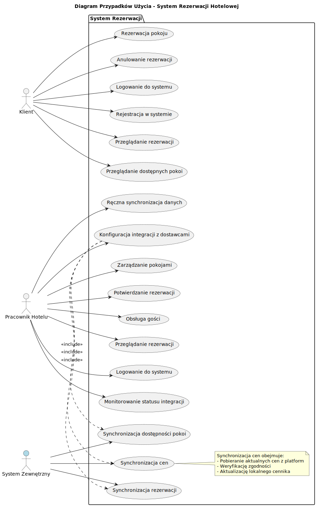
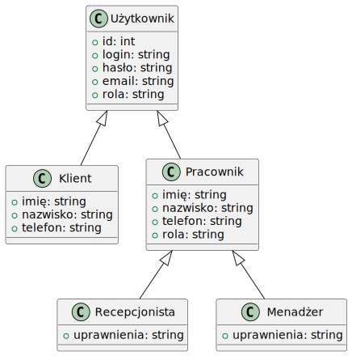

# Dokumentacja Projektowa Systemu Rezerwacji Hotelowej

## Wprowadzenie

Niniejszy dokument opisuje projekt systemu rezerwacji hotelowej. System ma na celu umożliwienie klientom rezerwacji pokoi, a personelowi zarządzanie pokojami i obsługę gości.

## Diagram Przypadków Użycia (Use Case Diagram)

*   **Aktorzy:**
    *   Klient
    *   Pracownik hotelu
*   **Przypadki użycia:**
    *   **Klient:**
        *   Przeglądanie dostępnych pokoi
        *   Rezerwacja pokoju
        *   Anulowanie rezerwacji
        *   Logowanie do systemu
        *   Rejestracja w systemie
    *   **Pracownik hotelu:**
        *   Zarządzanie pokojami (dodawanie, edycja, usuwanie)
        *   Potwierdzanie rezerwacji
        *   Obsługa gości (zameldowanie, wymeldowanie)
        *   Przeglądanie rezerwacji
        *   Logowanie do systemu

## Diagramy Aktywności (Activity Diagrams)

### Rezerwacja Pokoju

Opis diagramu aktywności dla rezerwacji pokoju:

1.  **Start:** Proces rozpoczyna się, gdy klient chce zarezerwować pokój.
2.  **Wyświetl dostępne pokoje:** System prezentuje klientowi listę dostępnych pokoi wraz z ich opisami i cenami.
3.  **Wybór pokoju:** Klient wybiera konkretny pokój.
4.  **Podanie danych:** Klient podaje swoje dane osobowe oraz daty pobytu.
5.  **Sprawdzenie dostępności:** System sprawdza, czy wybrany pokój jest dostępny w podanych terminach.
6.  **Dostępny?**
    *   **Tak:** Przejdź do punktu 7.
    *   **Nie:** System informuje klienta o braku dostępności i wraca do punktu 2 (wyświetlenie dostępnych pokoi).
7.  **Potwierdzenie rezerwacji:** System wyświetla podsumowanie rezerwacji.
8.  **Akceptacja rezerwacji:** Klient akceptuje rezerwację.
9.  **Zapisanie rezerwacji:** System zapisuje rezerwację w bazie danych.
10. **Wyświetlenie potwierdzenia:** System wyświetla potwierdzenie rezerwacji wraz z numerem rezerwacji.
11. **Koniec:** Proces rezerwacji zakończony.

### Zarządzanie Pokojami

Opis diagramu aktywności dla zarządzania pokojami:

1.  **Start:** Proces rozpoczyna się, gdy pracownik hotelu chce zarządzać pokojami.
2.  **Wyświetl menu zarządzania pokojami:** System prezentuje pracownikowi opcje zarządzania pokojami (dodawanie, edycja, usuwanie).
3.  **Wybór opcji:** Pracownik wybiera jedną z opcji: dodawanie, edycja lub usuwanie pokoju.
4.  **Dodawanie pokoju:**
    *   System prosi o podanie danych nowego pokoju (numer, typ, opis, cena).
    *   System zapisuje nowy pokój w bazie danych.
    *   Przejdź do punktu 8.
5.  **Edycja pokoju:**
    *   System prosi o podanie numeru pokoju do edycji.
    *   System wyświetla dane wybranego pokoju.
    *   System prosi o wprowadzenie zmian.
    *   System zapisuje zmiany w bazie danych.
    *   Przejdź do punktu 8.
6.  **Usuwanie pokoju:**
    *   System prosi o podanie numeru pokoju do usunięcia.
    *   System usuwa pokój z bazy danych.
    *   Przejdź do punktu 8.
7.  **Potwierdzenie:** System wyświetla potwierdzenie wykonania operacji.
8.  **Koniec:** Proces zarządzania pokojami zakończony.

### Logowanie do Systemu

Opis diagramu aktywności dla procesu logowania:

1.  **Start:** Proces rozpoczyna się, gdy użytkownik (klient lub pracownik hotelu) chce zalogować się do systemu.
2.  **Wybór roli:** Użytkownik wybiera swoją rolę (klient lub pracownik hotelu).
3.  **Podanie danych logowania:** System prosi o podanie danych logowania (login i hasło).
4.  **Weryfikacja danych:** System weryfikuje dane logowania w bazie danych.
5.  **Poprawne dane?**
    *   **Tak:** System loguje użytkownika i przechodzi do odpowiedniego interfejsu (klienta lub pracownika). Przejdź do punktu 7.
    *   **Nie:** System wyświetla komunikat o błędzie i wraca do punktu 3 (podanie danych logowania).
6.  **Dostęp do systemu:** Użytkownik ma dostęp do odpowiednich funkcji systemu.
7.  **Koniec:** Proces logowania zakończony.

### Rejestracja Użytkownika

Opis diagramu aktywności dla procesu rejestracji:

1.  **Start:** Proces rozpoczyna się, gdy użytkownik (klient) chce zarejestrować się w systemie.
2.  **Wybór rejestracji:** Użytkownik wybiera opcję rejestracji.
3.  **Podanie danych rejestracyjnych:** System prosi o podanie danych rejestracyjnych (imię, nazwisko, email, hasło).
4.  **Weryfikacja danych:** System weryfikuje, czy podany email nie jest już zarejestrowany.
5.  **Email zajęty?**
    *   **Tak:** System wyświetla komunikat o błędzie i wraca do punktu 3 (podanie danych rejestracyjnych).
    *   **Nie:** Przejdź do punktu 6.
6.  **Zapisanie danych:** System zapisuje dane użytkownika w bazie danych.
7.  **Potwierdzenie rejestracji:** System wyświetla potwierdzenie rejestracji.
8.  **Koniec:** Proces rejestracji zakończony.

### Anulowanie Rezerwacji

Opis diagramu aktywności dla procesu anulowania rezerwacji:

1.  **Start:** Proces rozpoczyna się, gdy klient chce anulować rezerwację.
2.  **Logowanie:** Klient loguje się do systemu.
3.  **Wyświetlenie rezerwacji:** System wyświetla listę rezerwacji klienta.
4.  **Wybór rezerwacji:** Klient wybiera rezerwację do anulowania.
5.  **Potwierdzenie anulowania:** System prosi o potwierdzenie anulowania rezerwacji.
6.  **Anulowanie?**
    *   **Tak:** System anuluje rezerwację i przechodzi do punktu 7.
    *   **Nie:** System wraca do punktu 3 (wyświetlenie rezerwacji).
7.  **Potwierdzenie anulowania:** System wyświetla potwierdzenie anulowania rezerwacji.
8.  **Koniec:** Proces anulowania rezerwacji zakończony.

### Zmiana Rezerwacji

Opis diagramu aktywności dla procesu zmiany rezerwacji:

1.  **Start:** Proces rozpoczyna się, gdy klient chce zmienić rezerwację.
2.  **Logowanie:** Klient loguje się do systemu.
3.  **Wyświetlenie rezerwacji:** System wyświetla listę rezerwacji klienta.
4.  **Wybór rezerwacji:** Klient wybiera rezerwację do zmiany.
5.  **Wybór nowych danych:** Klient wybiera nowe daty lub pokój.
6.  **Sprawdzenie dostępności:** System sprawdza, czy wybrany pokój jest dostępny w nowych terminach.
7.  **Dostępny?**
    *   **Tak:** Przejdź do punktu 8.
    *   **Nie:** System informuje klienta o braku dostępności i wraca do punktu 5 (wybór nowych danych).
8.  **Potwierdzenie zmiany:** System wyświetla podsumowanie zmiany rezerwacji.
9.  **Akceptacja zmiany:** Klient akceptuje zmianę rezerwacji.
10. **Zapisanie zmiany:** System zapisuje zmianę rezerwacji w bazie danych.
11. **Wyświetlenie potwierdzenia:** System wyświetla potwierdzenie zmiany rezerwacji.
12. **Koniec:** Proces zmiany rezerwacji zakończony.

### Obsługa Gościa

Opis diagramu aktywności dla obsługi gościa (zameldowanie i wymeldowanie):

1.  **Start:** Proces rozpoczyna się, gdy gość przybywa do hotelu (zameldowanie) lub chce opuścić hotel (wymeldowanie).
2.  **Wybór operacji:** Pracownik hotelu wybiera, czy gość się melduje, czy wymeldowuje.
3.  **Zameldowanie:**
    *   System prosi o podanie danych gościa (imię, nazwisko, numer rezerwacji).
    *   System sprawdza rezerwację.
    *   System przydziela pokój (jeśli nie był wcześniej przydzielony).
    *   System rejestruje zameldowanie gościa.
    *   Przejdź do punktu 6.
4.  **Wymeldowanie:**
    *   System prosi o podanie danych gościa (imię, nazwisko, numer pokoju).
    *   System sprawdza dane gościa.
    *   System rejestruje wymeldowanie gościa.
    *   Przejdź do punktu 6.
5.  **Potwierdzenie:** System wyświetla potwierdzenie wykonania operacji (zameldowania lub wymeldowania).
6.  **Koniec:** Proces obsługi gościa zakończony.

## Diagramy Klas (Class Diagrams)

### Rezerwacje

Opis diagramu klas dla rezerwacji:

*   **Klasa Rezerwacja:**
    *   `id_rezerwacji`: int (identyfikator rezerwacji)
    *   `id_klienta`: int (identyfikator klienta)
    *   `id_pokoju`: int (identyfikator pokoju)
    *   `data_od`: data (data rozpoczęcia rezerwacji)
    *   `data_do`: data (data zakończenia rezerwacji)
    *   `status`: string (status rezerwacji: "potwierdzona", "anulowana", "oczekująca")
    *   **Relacje:**
        *   Rezerwacja ma relację *wiele-do-jednego* z klasą `Gość` (jeden gość może mieć wiele rezerwacji).
        *   Rezerwacja ma relację *wiele-do-jednego* z klasą `Pokój` (jeden pokój może mieć wiele rezerwacji).
        *   Gość ma relację *jeden-do-wielu* z klasą `Rezerwacja` (jeden gość może mieć wiele rezerwacji).

## Diagramy

### Diagram Przypadków Użycia

Diagram przypadków użycia przedstawia interakcje między aktorami (klient, pracownik hotelu) a systemem. Aktorzy wykonują różne przypadki użycia, takie jak rezerwacja pokoju, zarządzanie pokojami, logowanie do systemu, itp.

### Diagramy Aktywności

Diagramy aktywności opisują przepływ pracy w systemie dla różnych przypadków użycia. Każdy diagram przedstawia sekwencję kroków, które są wykonywane w ramach danego przypadku użycia. Przykłady diagramów aktywności to rezerwacja pokoju, zarządzanie pokojami, logowanie do systemu, itp.

[Diagram aktywności rezerwacji pokoju](diagrams/activity_diagram_rezerwacja.svg)

[Diagram aktywności zarządzania pokojami](diagrams/activity_diagram_zarzadzanie_pokojami.svg)

[Diagram aktywności logowania](diagrams/activity_diagram_logowanie.svg)

[Diagram aktywności rezerwacji pokoju](diagrams/activity_diagram_rezerwacja.svg)

[Diagram aktywności zarządzania pokojami](diagrams/activity_diagram_zarzadzanie_pokojami.svg)

[Diagram aktywności logowania](diagrams/activity_diagram_logowanie.svg)

[Diagram aktywności zmiany rezerwacji](diagrams/activity_diagram_zmiana_rezerwacji.png)

### Diagramy Klas

Diagramy klas przedstawiają strukturę danych systemu, w tym klasy, ich atrybuty i relacje między nimi. Diagramy klas opisują modele danych, takie jak Użytkownik, Pracownik, Gość, Pokój, Rezerwacja.

[Diagram klas]

## Opis Modeli Danych

### Model Użytkownik

*   `id_uzytkownika`: INTEGER (Primary Key)
*   `login`: TEXT
*   `haslo`: TEXT
*   `email`: TEXT
*   `rola`: TEXT (klient, pracownik)

### Model Pracownik

*   `id_pracownika`: INTEGER (Primary Key)
*   `imie`: TEXT
*   `nazwisko`: TEXT
*   `email`: TEXT
*   `telefon`: TEXT
*   `login`: TEXT
*   `haslo`: TEXT
*   `rola`: TEXT (np. recepcjonista, menadżer)

### Model Gość

*   `id_klienta`: INTEGER (Primary Key)
*   `imie`: TEXT
*   `nazwisko`: TEXT
*   `email`: TEXT
*   `telefon`: TEXT

### Model Pokój

*   `id_pokoju`: INTEGER (Primary Key)
*   `numer_pokoju`: TEXT
*   `typ_pokoju`: TEXT (np. jednoosobowy, dwuosobowy, apartament)
*   `opis`: TEXT
*   `cena`: REAL
*   `dostepny`: BOOLEAN

### Model Rezerwacja

*   `id_rezerwacji`: INTEGER (Primary Key)
*   `id_klienta`: INTEGER (Foreign Key referencing Gość)
*   `id_pokoju`: INTEGER (Foreign Key referencing Pokój)
*   `data_od`: DATE
*   `data_do`: DATE
*   `status`: TEXT (potwierdzona, anulowana, oczekująca)

## Opis Interfejsu Użytkownika

### Ekran Logowania
*   Pola: Login, Hasło
*   Przyciski: Zaloguj, Rejestracja

### Ekran Rejestracji
*   Pola: Imię, Nazwisko, Email, Hasło
*   Przyciski: Zarejestruj, Powrót do logowania

### Ekran Główny Klienta
*   Wyświetla: Listę dostępnych pokoi, opcję rezerwacji, opcję przeglądania rezerwacji, opcję anulowania rezerwacji, opcję zmiany rezerwacji
*   Przyciski: Wyloguj

### Ekran Główny Pracownika
*   Wyświetla: Opcje zarządzania pokojami, opcje obsługi gości, opcję przeglądania rezerwacji
*   Przyciski: Wyloguj

## Opis Bazy Danych

### Tabela Użytkownicy
*   `id_uzytkownika`: INTEGER PRIMARY KEY
*   `login`: TEXT
*   `haslo`: TEXT
*   `email`: TEXT
*   `rola`: TEXT (klient, pracownik)

### Tabela Pracownicy
*   `id_pracownika`: INTEGER PRIMARY KEY
*   `imie`: TEXT
*   `nazwisko`: TEXT
*   `email`: TEXT
*   `telefon`: TEXT
*   `login`: TEXT
*   `haslo`: TEXT
*   `rola`: TEXT (np. recepcjonista, menadżer)
*   **Relacje:**
    *   Pracownik ma relację *jeden-do-jednego* z tabelą `Użytkownicy` (jeden pracownik ma jedno konto użytkownika).

### Tabela Goście
*   `id_klienta`: INTEGER PRIMARY KEY
*   `imie`: TEXT
*   `nazwisko`: TEXT
*   `email`: TEXT
*   `telefon`: TEXT
*   **Relacje:**
    *   Gość ma relację *jeden-do-wielu* z tabelą `Rezerwacje` (jeden gość może mieć wiele rezerwacji).

### Tabela Pokoje
*   `id_pokoju`: INTEGER PRIMARY KEY
*   `numer_pokoju`: TEXT
*   `typ_pokoju`: TEXT (np. jednoosobowy, dwuosobowy, apartament)
*   `opis`: TEXT
*   `cena`: REAL
*   `dostepny`: BOOLEAN
*   **Relacje:**
    *   Pokój ma relację *jeden-do-wielu* z tabelą `Rezerwacje` (jeden pokój może być zarezerwowany wiele razy).

### Tabela Rezerwacje
*   `id_rezerwacji`: INTEGER PRIMARY KEY
*   `id_klienta`: INTEGER
*   `id_pokoju`: INTEGER
*   `data_od`: DATE
*   `data_do`: DATE
*   `status`: TEXT (potwierdzona, anulowana, oczekująca)
*   **Relacje:**
    *   Rezerwacja ma relację *wiele-do-jednego* z tabelą `Goście` (jeden gość może mieć wiele rezerwacji).
    *   Rezerwacja ma relację *wiele-do-jednego* z tabelą `Pokoje` (jeden pokój może mieć wiele rezerwacji).

## Technologie Użyte

*   **Język programowania:** Python
*   **Framework:** Flask
*   **Baza danych:** SQLite
*   **Biblioteka ORM:** SQLAlchemy

## Plan Testów

*   **Testy jednostkowe:** Testowanie poszczególnych funkcji i klas.
*   **Testy integracyjne:** Testowanie interakcji między różnymi modułami systemu.
*   **Testy akceptacyjne:** Testowanie systemu z perspektywy użytkownika.
*   **Testy bezpieczeństwa:** Testowanie systemu pod kątem luk bezpieczeństwa.

## Architektura Systemu

System rezerwacji hotelowej będzie oparty na architekturze trójwarstwowej:

1.  **Warstwa prezentacji (UI):**
    *   Odpowiedzialna za interakcję z użytkownikiem.
    *   Zawiera interfejs użytkownika (ekrany logowania, rejestracji, główne ekrany klienta i pracownika).
    *   Używa Flask do obsługi żądań HTTP i renderowania szablonów HTML.

2.  **Warstwa logiki biznesowej (aplikacji):**
    *   Odpowiedzialna za logikę aplikacji, w tym obsługę rezerwacji, zarządzanie pokojami, autentykację użytkowników.
    *   Zawiera klasy i funkcje, które implementują przypadki użycia.
    *   Komunikuje się z warstwą prezentacji i warstwą danych.

3.  **Warstwa danych:**
    *   Odpowiedzialna za dostęp do danych w bazie danych.
    *   Używa SQLAlchemy do mapowania obiektowo-relacyjnego (ORM).
    *   Zawiera modele danych (klasy reprezentujące tabele w bazie danych).

**Komponenty:**

*   **Moduł Użytkowników:** Obsługuje logowanie, rejestrację i zarządzanie użytkownikami.
*   **Moduł Rezerwacji:** Obsługuje rezerwacje pokoi, anulowanie i zmiany rezerwacji.
*   **Moduł Pokoi:** Obsługuje zarządzanie pokojami (dodawanie, edycja, usuwanie).
*   **Moduł Gości:** Obsługuje dane gości.
*   **Moduł Pracowników:** Obsługuje dane pracowników.

**Interakcje:**

*   Warstwa prezentacji wysyła żądania do warstwy logiki biznesowej.
*   Warstwa logiki biznesowej przetwarza żądania i komunikuje się z warstwą danych.
*   Warstwa danych wykonuje operacje na bazie danych.

## Plan Wdrożenia

1.  **Konfiguracja serwera:** Przygotowanie serwera do hostowania aplikacji.
2.  **Instalacja oprogramowania:** Instalacja niezbędnego oprogramowania (Python, Flask, itp.).
3.  **Konfiguracja bazy danych:** Konfiguracja bazy danych SQLite.
4.  **Wdrożenie aplikacji:** Wdrożenie aplikacji na serwerze.
5.  **Testowanie w środowisku produkcyjnym:** Przeprowadzenie testów w środowisku produkcyjnym.
6.  **Uruchomienie systemu:** Uruchomienie systemu dla użytkowników.
7.  **Monitoring:** Monitorowanie działania systemu.

## Opis API

### Użytkownicy

*   **POST /users/register:** Rejestracja nowego użytkownika.
*   **POST /users/login:** Logowanie użytkownika.
*   **GET /users/{id}:** Pobranie danych użytkownika o podanym ID.

### Pokoje

*   **GET /rooms:** Pobranie listy wszystkich pokoi.
*   **GET /rooms/{id}:** Pobranie danych pokoju o podanym ID.
*   **POST /rooms:** Dodanie nowego pokoju (tylko dla pracowników).
*   **PUT /rooms/{id}:** Edycja danych pokoju o podanym ID (tylko dla pracowników).
*   **DELETE /rooms/{id}:** Usunięcie pokoju o podanym ID (tylko dla pracowników).

### Rezerwacje

*   **GET /reservations:** Pobranie listy wszystkich rezerwacji.
*   **GET /reservations/{id}:** Pobranie danych rezerwacji o podanym ID.
*   **POST /reservations:** Dodanie nowej rezerwacji.
*   **PUT /reservations/{id}:** Edycja danych rezerwacji o podanym ID.
*   **DELETE /reservations/{id}:** Anulowanie rezerwacji o podanym ID.
*   **GET /reservations/user/{user_id}**: Pobranie rezerwacji dla danego użytkownika.

### Goście

*   **GET /guests:** Pobranie listy wszystkich gości.
*   **GET /guests/{id}:** Pobranie danych gościa o podanym ID.
*   **POST /guests:** Dodanie nowego gościa.
*   **PUT /guests/{id}:** Edycja danych gościa o podanym ID.
*   **DELETE /guests/{id}:** Usunięcie gościa o podanym ID.

Opis diagramu klas dla pracowników hotelu:

*   **Klasa Pracownik:**
    *   `id_pracownika`: int (identyfikator pracownika)
    *   `imie`: string (imię pracownika)
    *   `nazwisko`: string (nazwisko pracownika)
    *   `email`: string (adres email pracownika)
    *   `telefon`: string (numer telefonu pracownika)
    *   `login`: string (login pracownika)
    *   `haslo`: string (hasło pracownika)
    *   `rola`: string (rola pracownika np. "recepcjonista", "menadżer")

### Użytkownik

Opis diagramu klas dla użytkowników systemu:

*   **Klasa Użytkownik:**
    *   `id_uzytkownika`: int (identyfikator użytkownika)
    *   `login`: string (login użytkownika)
    *   `haslo`: string (hasło użytkownika)
    *   `email`: string (adres email użytkownika)
    *   `rola`: string (rola użytkownika np. "klient", "pracownik")

        *   Pokój ma relację *jeden-do-wielu* z klasą `Rezerwacja` (jeden pokój może być zarezerwowany wiele razy).

### Pokoje

Opis diagramu klas dla pokoi:

*   **Klasa Pokój:**
    *   `id_pokoju`: int (identyfikator pokoju)
    *   `numer_pokoju`: string (numer pokoju)
    *   `typ_pokoju`: string (np. "jednoosobowy", "dwuosobowy", "apartament")
    *   `opis`: string (opis pokoju)
    *   `cena`: decimal (cena za noc)
    *   `dostepny`: boolean (czy pokój jest dostępny)
    *   **Relacje:**
        *   Pokój ma relację *jeden-do-wielu* z klasą `Rezerwacja` (jeden pokój może być zarezerwowany wiele razy).

### Goście

Opis diagramu klas dla gości:

*   **Klasa Gość:**
    *   `id_klienta`: int (identyfikator klienta)
    *   `imie`: string (imię gościa)
    *   `nazwisko`: string (nazwisko gościa)
    *   `email`: string (adres email gościa)
    *   `telefon`: string (numer telefonu gościa)
    *   **Relacje:**
        *   Gość ma relację *jeden-do-wielu* z klasą `Rezerwacja` (jeden gość może mieć wiele rezerwacji).
